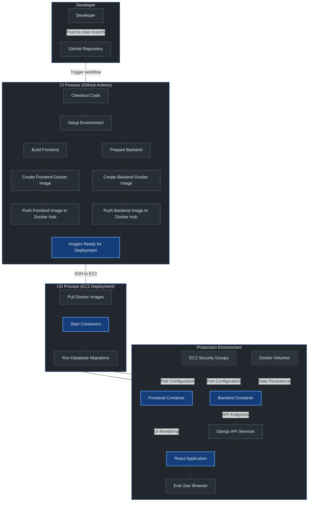

# CI/CD Pipeline for Django and React Application

CI/CD (Continuous Integration/Continuous Deployment) automates the process of building, testing, and deploying software. It's like having a digital assembly line that takes code changes, automatically verifies they work properly, packages them up, and delivers them to users—all without manual intervention. This automation helps teams release better software faster, with fewer errors and less downtime.

This documentation provides a comprehensive guide to setting up a complete CI/CD pipeline for deploying a Django backend and React frontend to AWS EC2 using GitHub Actions, Docker, and Docker Hub.

This project demonstrates a professional CI/CD pipeline for a basic e-commerce dashboard built with Django and React. The application features user authentication and provides sellers with tools to manage their products, track sales, and view analytics. 

## Table of Contents

1. [Project Structure](#project-structure)
2. [Local Development Setup](#local-development-setup)
3. [Docker Configuration](#docker-configuration)
4. [GitHub Actions Workflow](#github-actions-workflow)
5. [AWS EC2 Configuration](#aws-ec2-configuration)
6. [Database Configuration](#database-configuration)
7. [Troubleshooting](#troubleshooting)
8. [Reference Commands](#reference-commands)
 
## Project Structure

  

The project is organized as follows:

  

```

project-root/

├── .github/
│ └── workflows/
│ └── deploy.yml # GitHub Actions workflow
├── docker/
│ ├── backend/
│ │ ├── dockerfile # Backend Docker configuration
│ │ └── entrypoint.sh # Backend container startup script
│ ├── frontend/
│ │ └── dockerfile # Frontend Docker configuration
│ └── docker-compose.yml # Development Docker Compose configuration
├── backend/
│ ├── requirements.txt # Python dependencies
│ ├── manage.py
│ └── ... (Django project files)
└── frontend/
├── package.json # JavaScript dependencies
├── vite.config.js # Vite configuration
└── ... (React project files)
```

## Local Development Setup

  

### Prerequisites

- Git
- Docker and Docker Compose
- Node.js (v18+)
- Python (3.11+)

### Backend Setup

1. Create a virtual environment and install dependencies:
```bash
cd backend
python -m venv venv
source venv/bin/activate # On Windows: venv\Scripts\activate
pip install -r requirements.txt
```

2. Configure the database settings in `settings.py`:

```python
DATABASES = {
'default': {
'ENGINE': 'django.db.backends.sqlite3',
'NAME': os.path.join(BASE_DIR, 'db.sqlite3'),
}
}
```

 
3. Run migrations and create a superuser:

```bash
python manage.py migrate
python manage.py createsuperuser
```

4. Start the development server:

```bash
python manage.py runserver
```

### Frontend Setup

1. Install dependencies:

```bash
cd frontend
npm install
```

  

2. Configure environment variables by creating `.env.development`:

```
VITE_GRAPHQL_API=http://localhost:8000/graphql/
```

  

3. Start the development server:

```bash
npm run dev
```

  

## Docker Configuration

  

### Backend Dockerfile (docker/backend/dockerfile)

```dockerfile
FROM python:3.11
WORKDIR /app

COPY requirements.txt .

# Install dependencies including gunicorn
RUN pip install -r requirements.txt && pip install gunicorn

COPY . .

# Run collectstatic for production

RUN python manage.py collectstatic --noinput

# Command to run the application

CMD ["gunicorn", "backend.wsgi:application", "--bind", "0.0.0.0:8000"]

```

  

### Frontend Dockerfile (docker/frontend/dockerfile)

```dockerfile
FROM node:22
  
WORKDIR /app
  
ENV ROLLUP_SKIP_NODEJS_OPTIONAL=1

COPY package*.json ./

RUN npm install
 
COPY . .

EXPOSE 5173

CMD ["npm", "run", "preview", "--", "--host"]
```

  

### Docker Compose Configuration (docker/docker-compose.yml)

```yaml
services:
  backend:
    build:
      context: ../backend
      dockerfile: ../docker/backend/dockerfile
    ports:
      - "8000:8000"
    volumes:
      - ../docker/backend/entrypoint.sh:/app/entrypoint.sh
      - static_volume:/app/staticfiles 

    command: sh -c "chmod +x /app/entrypoint.sh && /app/entrypoint.sh"

  frontend:
    build:
      context: ../frontend
      dockerfile: ../docker/frontend/dockerfile
    ports:
      - "5173:5173"
    command: npm run preview -- --host

volumes:
  static_volume:
  
```

  

## GitHub Actions Workflow

  

The GitHub Actions workflow automates building, pushing, and deploying your Docker containers to EC2 whenever code is pushed to the main branch.

  

### Setting Up GitHub Secrets

  

Go to your GitHub repository → Settings → Secrets and variables → Actions and add these secrets:

  

-  `AWS_ACCESS_KEY_ID`: Your AWS access key

-  `AWS_SECRET_ACCESS_KEY`: Your AWS secret key

-  `EC2_INSTANCE_IP`: Your EC2 instance public IP

-  `EC2_SSH_PRIVATE_KEY`: SSH private key to access your EC2 instance

-  `DOCKER_USERNAME`: Your Docker Hub username

-  `DOCKER_PASSWORD`: Your Docker Hub password or access token

-  `DB_HOST`: Database hostname (if using external database)

-  `DB_USER`: Database username

-  `DB_PASSWORD`: Database password

-  `DB_NAME`: Database name
  
-  `DB_PORT`: Databse port 

  

### Workflow File (.github/workflows/deploy.yml)

```yaml
name: Deploy to EC2

on:
  push:
    branches: ["main"]

env:
  AWS_REGION: us-east-1
  EC2_INSTANCE_IP: ${{ secrets.EC2_INSTANCE_IP }}
  EC2_SSH_PRIVATE_KEY: ${{ secrets.EC2_SSH_PRIVATE_KEY }}
  DB_HOST: ${{ secrets.DB_HOST }}
  DB_USER: ${{ secrets.DB_USER }}
  DB_PASSWORD: ${{ secrets.DB_PASSWORD }}
  DB_NAME: ${{ secrets.DB_NAME }}
  DB_PORT: ${{ secrets.DB_PORT }}
  DOCKER_USERNAME: ${{ secrets.DOCKER_USERNAME }}
  DOCKER_PASSWORD: ${{ secrets.DOCKER_PASSWORD }}

jobs:
  deploy:
    runs-on: ubuntu-latest

    steps:
      # Checkout repository
      - name: Checkout code
        uses: actions/checkout@v3

      # Setup Node.js
      - name: Setup Node.js
        uses: actions/setup-node@v3
        with:
          node-version: '18.x'

      # Install frontend dependencies and build
      - name: Install frontend dependencies
        run: |
          cd frontend/
          npm install
          npm run build

      # Install Docker Compose
      - name: Install Docker Compose
        run: |
          sudo apt-get update
          sudo apt-get install -y docker-compose
          docker-compose --version

      # Docker login step
      - name: Login to Docker Hub
        run: |
          echo "${{ secrets.DOCKER_PASSWORD }}" | docker login -u "${{ secrets.DOCKER_USERNAME }}" --password-stdin
          echo "Docker login successful"

      # Build and push images using individual Docker commands
      - name: Build and push Docker images
        run: |
          # Build backend with latest tag
          docker build -t ${{ secrets.DOCKER_USERNAME }}/graphql-dashboard-backend:latest -f docker/backend/dockerfile backend/
          
          # Build frontend with latest tag
          docker build -t ${{ secrets.DOCKER_USERNAME }}/graphql-dashboard-frontend:latest -f docker/frontend/dockerfile frontend/
          
          # Test access to Docker Hub
          docker info
          
          # Push all images to Docker Hub
          docker push ${{ secrets.DOCKER_USERNAME }}/graphql-dashboard-backend:latest
          docker push ${{ secrets.DOCKER_USERNAME }}/graphql-dashboard-frontend:latest

      # Create a deployment docker-compose file for EC2
      - name: Create deployment docker-compose file
        run: |
          cat << EOF > ec2-docker-compose.yml
        
          services:
            backend:
              image: ${{ secrets.DOCKER_USERNAME }}/graphql-dashboard-backend:latest
              ports:
                - "8000:8000"
              environment:
                - DB_HOST=${{ env.DB_HOST }}
                - DB_USER=${{ env.DB_USER }}
                - DB_PASSWORD=${{ env.DB_PASSWORD }}
                - DB_NAME=${{ env.DB_NAME }}
                - DB_PORT=${{ env.DB_PORT }}
              restart: always
            
            frontend:
              image: ${{ secrets.DOCKER_USERNAME }}/graphql-dashboard-frontend:latest
              ports:
                - "5173:4173"
              restart: always
          EOF

      # Prepare deployment script
      - name: Prepare deployment script
        run: |
          cat << EOF > deploy.sh
          #!/bin/bash
          set -e
          
          # Pull latest images
          docker-compose -f ec2-docker-compose.yml pull
          
          # Stop and remove existing containers
          docker-compose -f ec2-docker-compose.yml down
          
          # Start new containers
          docker-compose -f ec2-docker-compose.yml up -d
          
          # Clean up unused images
          docker image prune -f
          EOF
          chmod +x deploy.sh

      # Transfer docker-compose.yml and deploy.sh to EC2 using SCP action
      - name: Copy files to EC2
        uses: appleboy/scp-action@master
        with:
          host: ${{ env.EC2_INSTANCE_IP }}
          username: ec2-user
          key: ${{ env.EC2_SSH_PRIVATE_KEY }}
          source: "ec2-docker-compose.yml,deploy.sh"
          target: "/home/ec2-user/"

      # Deploy on EC2 via SSH
      - name: Execute deployment script on EC2
        uses: appleboy/ssh-action@master
        with:
          host: ${{ env.EC2_INSTANCE_IP }}
          username: ec2-user
          key: ${{ env.EC2_SSH_PRIVATE_KEY }}
          script: |
           
            sudo service docker start
            
            # Login to Docker Hub to pull private images if needed
            echo "${{ env.DOCKER_PASSWORD }}" | docker login -u "${{ env.DOCKER_USERNAME }}" --password-stdin
            
            cd /home/ec2-user
            chmod +x deploy.sh
            ./deploy.sh
            
            # Wait for containers to fully start
            echo "Waiting for containers to start..."
            sleep 5
            
            # Run migrations
            echo "Running database migrations..."
            docker exec -i ec2-user-backend-1 python manage.py migrate
```

  

## AWS EC2 Configuration

  

### Launch an EC2 Instance

1. Log in to the AWS Management Console
2. Navigate to EC2 service
3. Launch an instance with Amazon Linux 2
4. Choose an appropriate instance type (t2.micro is free tier eligible)
5. Configure a security group with these inbound rules:
- SSH (Port 22) from your IP address
- HTTP (Port 80) from anywhere
- Custom TCP (Port 8000) from anywhere (backend)
- Custom TCP (Port 5173) from anywhere (frontend)
6. Launch the instance with a key pair you can access

  

### Configure SSH Access

1. Generate an SSH key pair if you don't have one:

```bash
ssh-keygen -t rsa -b 4096 -C "your_email@example.com"
```

  

2. Add the public key to your EC2 instance:

```bash
ssh-copy-id -i ~/.ssh/id_rsa.pub ec2-user@your-ec2-ip
```

  

3. Add the private key to GitHub repository secrets as `EC2_SSH_PRIVATE_KEY`

  

## Database Configuration

  

### Using MySQL or PostgreSQL (Recommended for Production)

For a production environment, it's better to use a dedicated database server:

  

1. Update your Django settings.py:

```python

DATABASES = {

'default': {
'ENGINE': 'django.db.backends.postgresql', # or mysql
'NAME': os.environ.get('DB_NAME', 'default_db_name'),
'USER': os.environ.get('DB_USER', 'default_user'),
'PASSWORD': os.environ.get('DB_PASSWORD', 'default_password'),
'HOST': os.environ.get('DB_HOST', 'localhost'),
'PORT': os.environ.get('DB_PORT', '5432'), # 3306 for MySQL
}
}

```

  

2. Install the required database client in your Dockerfile:

```dockerfile
# For PostgreSQL
RUN pip install psycopg2-binary
# For MySQL
RUN pip install mysqlclient
```

  

## Environment Variables Configuration

  

### Backend Environment Variables

Create a `.env` file in your backend directory for local development:

```

DB_NAME=yourdbname
DB_USER=youruser
DB_PASSWORD=yourpassword
DB_HOST=localhost
DEBUG=True
```

In production, these are passed as environment variables in the docker-compose.yml.

### Frontend Environment Variables

For Vite-based React applications, create `.env.production`:

```

VITE_GRAPHQL_API=http://your-ec2-ip:8000/graphql/

```

  

Note: Vite requires environment variables to be prefixed with `VITE_` for them to be exposed to the client-side code.

  

## Static Files Configuration

  

To properly serve static files in Django:

  

1. Configure settings.py:

```python
# Static files settings
STATIC_URL = '/static/'
STATIC_ROOT = os.path.join(BASE_DIR, 'staticfiles')
# Add this for development to serve static files
STATICFILES_DIRS = [
os.path.join(BASE_DIR, 'static'),
]
```

  

2. Add the static files URL patterns in urls.py:

```python
from django.conf import settings
from django.conf.urls.static import static

urlpatterns = [
# Your existing URL patterns
]

if settings.DEBUG:
urlpatterns += static(settings.STATIC_URL, document_root=settings.STATIC_ROOT)
```

  

3. Run collectstatic in your Dockerfile or during deployment:

```bash
python manage.py collectstatic --noinput
```

  

## Troubleshooting

  

### Static Files Issues

If static files aren't loading:

1. Verify collectstatic ran successfully
2. Check STATIC_URL and STATIC_ROOT in settings.py
3. Ensure your Docker volume configuration is correct
4. In production (DEBUG=False), consider using WhiteNoise or another static files server

  

### Database Connection Issues

If you encounter database errors:

1. Check connection credentials
2. Verify that your database is accessible from your EC2 instance
3. Check security groups and network configuration
4. Verify that migrations have been applied: `docker exec -i container_name python manage.py showmigrations`

### Docker Issues

Common Docker problems:

1. Container not starting: `docker logs container_id`

2. Port conflicts: Make sure ports 8000 and 5173 aren't used by other services

3. Permission issues: Make sure your user has permissions to run Docker

  

### CORS Issues

If you encounter Cross-Origin Request Blocked errors:

1. Install django-cors-headers:

```bash
pip install django-cors-headers
```

  

2. Add to INSTALLED_APPS in settings.py:

```python
INSTALLED_APPS = [
# ...
'corsheaders',
# ...
]
```

  

3. Add middleware (must be at the top):

```python
MIDDLEWARE = [
'corsheaders.middleware.CorsMiddleware',
# Other middleware...
]
```

  

4. Configure CORS settings:

```python
CORS_ALLOWED_ORIGINS = [
"http://your-ec2-ip:5173",
]
```

  

## Reference Commands

  

### Docker Commands

```bash
# View running containers
docker  ps
  
# View container logs
docker  logs  container_id
  
# Execute command in a container
docker  exec  -it  container_id  command
  
# SSH into a container
docker  exec  -it  container_id  bash
```

  

### Django Management Commands

```bash
# Run migrations
docker  exec  -i  container_id  python  manage.py  migrate
 
# Create superuser
docker  exec  -i  container_id  python  manage.py  createsuperuser
  
# Collect static files
docker  exec  -i  container_id  python  manage.py  collectstatic  --noinput
  
# Create a new app
docker  exec  -i  container_id  python  manage.py  startapp  app_name
```

  

### Database Backup and Restore

```bash
# Backup SQLite database
docker  exec  -i  container_id  sh  -c  "sqlite3 db.sqlite3 .dump > /tmp/backup.sql"

docker  cp  container_id:/tmp/backup.sql  ./backup.sql
  
# Restore SQLite database
docker  cp  ./backup.sql  container_id:/tmp/backup.sql

docker  exec  -i  container_id  sh  -c  "cat /tmp/backup.sql | sqlite3 db.sqlite3"
```

  

## CI/CD Pipeline Flow

  

The complete flow of the CI/CD pipeline:

  

```
Developer → GitHub → GitHub Actions → Docker Hub → EC2 → End Users
```

  

1. Developer pushes code to GitHub repository (main branch)
2. GitHub Actions workflow is triggered automatically
3. Workflow builds frontend and creates Docker images
4. Images are pushed to Docker Hub
5. Workflow connects to EC2 via SSH and deploys the application
6. Database migrations are run and the application is ready for use
7. End users can access the application via EC2 public IP

## Flow Diagram 

